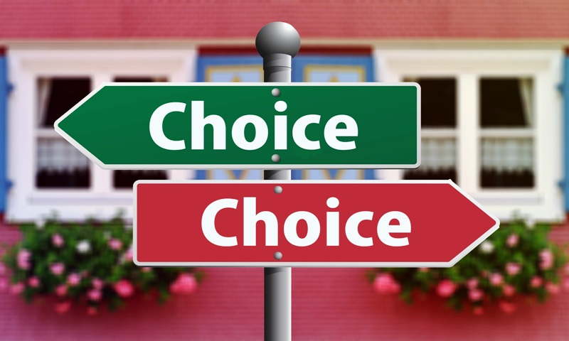

You may have read a lot of different "steps" or tips on how to get out of debt and **most of them don't actually work in practice**.  They do make sense but why don't they work? Here are some examples:

* *"List your debts from highest to the lowest interest rates and pay the ones with the highest interest first to avoid incurring more interests before moving on the next payments."*
* *"Consolidate all your debts and make it into just one payment to manage it better."*
* *"Earn extra money so that you can pay your balances faster."*
* *"Stop buying things that you don't really need."*

These are all very good tips but they don't work for most people because it doesn't really motivate them.  Just thinking about any one of these doesn't really excite them - it may even seem daunting.

A person with debt problems doesn't even have the energy to think about anything else because he or she is already too stressed out fighting to just survive.

### You need to focus on these 2 things:
1. **Acceptance**
2. **Decision**

First is **ACCEPTANCE**, this is the hardest part - to admit that you have a debt problem.  You can't even begin to think about saving for your future because of all the debt payments you have.  Accept also that you can't do it alone. Find a partner, a true friend, or a trusted adviser who is good with money - and ask him or her to check up on you to remind you everyday that you need to find a solution to this problem as soon as possible.  There's no shame in admitting we have problems and we've done mistakes, the important thing is that you're now looking for solutions.

Second is **DECISION**.   Now you understand that you have a serious problem, you need to decide whether you're just ok to always live with it OR decide that you're already sick and tired of being sick and tired.  You decide and say "Never Again!".  Never again will I be at the mercy of collectors and loan sharks every month, never again will I destroy my relationships with my family and friends just because of debt, and never again will I allow this problem to control my life.  Decide to be debt-free and stay that way.

After you have accepted and decided, let me now give you this very first step to finally work on your debt-free journey: **STOP BORROWING MORE MONEY** no matter what!  This is never easy because there will always be that unexpected something that needs to be taken care of.  (*That's why having an emergency fund is very important*)  Now that you have accepted and decided, I know you'll find a way to do it.  If you have already stopped the leak of the sinking boat then you can follow all the "*steps-to-get-out-of-debt*" you can find out there and will certainly work for you now.

As Dave Ramsey said "***Personal Finance is 80% Behavior and only 20% Knowledge***".  So your attitude has a greater role to your journey to financial freedom than your intellect.

I believe there is hope for everyone and you can have a stressed-free and Debt-free life.  Cheers!