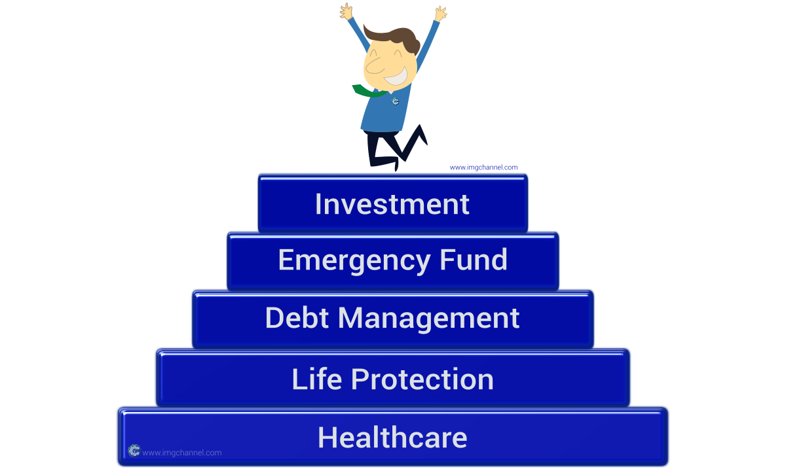

**Stress brought about by money problems are the worst.**  They often destroy our self-esteem, our work life, our family life, and even our health.  The irony is that we know that money is not the most important thing in this world - our relationships and health are.  **So why does it affect us terribly?**  It is because, in our modern world, almost everything we do requires money including everything important to us like food, education, health, vacations, etc. 

Conversations about money with our family are never easy - oftentimes it doesn't happen.  **Talking about money is taboo for most families** that's why we just choose not to talk about it because sometimes it leads to arguments.  This is more of a relationship problem, not a financial one.  In a good and healthy relationship you can always talk about anything, especially about money, so if you want to check how well your relationship is, talk about it.  **The way you talk about money is often a reflection of your relationships.**

Make this part of the discussion - **having a solid financial plan**.  It would give your family a chance to see your common goals and a chance for each member to contribute in any way they can to achieve that goal.  You will have an alignment of priorities and deeper understanding of each other's concerns and aspirations thus bringing you closer.

## Here are 5 steps to building a solid financial plan:

##1. Proper Healthcare Coverage
Some of you already have short-term healthcare which may be part of your employment benefits.  If you don't have this benefit or maybe you're self-employed or a business owner, you have to get yourself short-term healthcare.  All medical expenses should be covered in case the need arises while still actively working and earning.  This is important because **some medical emergencies may bankrupt you** if you don't have healthcare.

After making sure you have short-term healthcare, start saving for **long-term care** as soon as possible - this is in preparation for your medical needs when you stop working.  Most people neglect this because it is not urgent but if you don't take care of your long-term healthcare now **you may end up losing your retirement fund** just to pay for medical costs later.

 

## 2. Enough Life Insurance or Protection
Having life insurance is an important part of your financial plan because the **loss of a breadwinner can be devastating** for the family both emotionally and financially.  You can't solve the emotional part but you can do something about the financial one.  Having enough life insurance coverage will guarantee your loved ones to continue to live comfortably even when you can no longer provide for them.

Buying the **right kind of life insurance** is a bit tricky.  Insurance companies have so many different products with so many different names.  The average consumer wouldn't know how to choose and may just end up buying the product that the agent pushes.  The only kind of life insurance that provides the best value for your money is **Term Life Insurance**.  A good rule of thumb for the face amount (insurance coverage) is **10 times** your annual income.

 

## 3. Debt Management
Pay off all your debts and stay debt-free.  It is very tough for you to start saving and investing if you have debt payments because the interests alone will eat up a big part of your income.  **Staying debt-free** will really jumpstart your financial plan and will keep you focused ahead instead of getting stuck in your past errors.  *Nathan W. Morris* said **“*Every time you borrow money, you’re robbing your future self.*”**  You may want to read my previous article [*“Start Your Debt-free Journey with these 2 Things”*](https://www.imgchannel.com/blog/start-your-debt-free-journey-with-these-2-things).

 

## 4. Emergency Fund
This is like insurance but just for the small stuff.  Life happens and there is “*that another important thing*” to take care of every now and then.  That’s why for the little “*emergencies*” like fixing the car, sudden electricity bill increase, birthday party gifts, etc. **your emergency fund is very crucial**.  It will protect you from going back into debt and disrupting your investment strategies.  A good emergency fund is about **4 to 8 months** of your equivalent expenses.  Unexpected things do happen, so expect them.

 

## 5. Investments
There are a lot of “investments” you can find out there but I’m talking about liquid (*cash*) investments here.  Start with liquid investments because it is easier to understand and is very affordable, so literally **everyone can do it**.  I recommend investing in **mutual funds**.  It's mostly managed funds so you don't have to learn all the technical stuff about the stock market.  Another thing is that it's well-**diversified** (*spread around*) thus making it less risky.

For most people, mutual funds are the way to go. The track record for mutual fund growth is around an **average of 8% to 12% annually**.  It grows way better than your regular savings bank account and you can start investing for **as low as PHP1,000**.  Building wealth through investing is great but remember to first build your **proper foundation** so you will have the peace of mind of knowing that you're **taking care of your responsibilities while building your wealth**.

Make these simple steps as a guide when you create or refresh your financial plan and hopefully, it will keep you right on track on your journey. 

Thank you for reading.
May you have an abundant life.  God bless you.
