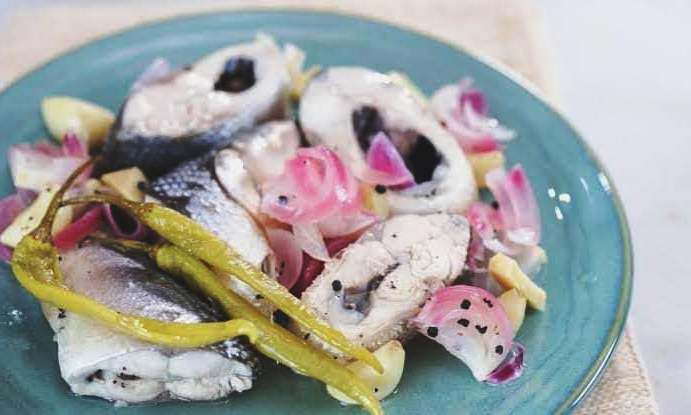

Funny but yeah I'd like to share this one. 
I would title it *"The Parable of Paksiw na Isda."* 
Read on to know why.

Last night, I was somewhat heart broken because when I got home, I learned that our Mingkay ate my paksiw na isda.  And I even reprimanded our miming (*as if they were little children and they were paying attention to me*) coz they were given food already but still ate my supposed to be ulam.

I thought dili ko maka sleep coz I was just so sad kay medyo dghan jud to na paksiw ai.  Gisayangan ko and at the same time disappointed coz I wasn't able to eat it myself.
And so before I slept, I told God.

 

"Nahurt jud ko sa paksiw Lord.  natarong jud to og keep, but still nakuha sa miming. Unsa nga lesson imong gusto iteach sa akoa with that incident?" (*I even told Roomie Riri Mi about my question before I slept*)

And so, at 5AM today, the very moment I woke up, God told me in my heart the answer to that weird question last night. 
And here it is.

"*Okay, Stela. First, I'd like you to understand that there are things ahead of you that you're not seeing or expecting so much and now I'd like you to see them, expect them and train yourself for them."*

*In the next season of your life (soonest nani siya Lord? ), you will not be living for your own.*
* **You will not just store food for yourself.**
* **You will not have enough time for yourself.**
* **You will not have enough time to sleep, eat or rest.**
* **You will be pre-occupied with new responsibilities and concerns.**
* **You will be putting yourself SECOND in the cares of this world.**

*Remember Proverbs 31?* That's what I'm talking about"
Just like that paksiw. It was taken from you by those cats and you cannot even eat the leftovers. It was painful, wasn't it? But you need to get used to it for love is actually giving away.

Then I was like.
*As in Lord!!!???* 

After that, I actually felt better and told myself.. okay natong paksiw oi.  Lablab nako ang mga mingkay, naminaw baya sila sa akoang pag reprimand.  **And I got some extra realizations as well.**
1. **If you have prayers that are still unanswered, maybe you're not ready yet.** (We all know what I'm talking about )

2. **There is a time for everything, and a season for every activity under heaven.** (Ecclesiastes 3:1) 

3. **To the STUDENTS - this is the perfect time to focus sa inyong studies and responsibilities as a son/daughter at home.** Dili usa mag relationship goals  One reason of having a failing generation is because some of the parents today were not actually ready when they became one.

4. **Take the time to build your character and skills.** Life is not a bed of roses. There are challenges and rough roads ahead.

5. **Build a strong foundation of God's Word and relationship with Christ.**

6. **TO THE LADIES - Practice the disciplines mentioned in Proverbs 31.**  Do not claim the qualities mentioned there as your bio adjectives. Be intentional. Those are actually commands and to do lists. 

7. **Learn and possess these qualities**

   ***a. humility and meekness*** because we don't have the wisdom of God. We are always learning and growing. Everyday.

   ***b. Selflessness and generosity*** ( just like how a mother gives her all to her child) - when you have your own family, dili na imoha ang unang hungit. 

    ***c. Learn the household chores!***  You cannot just pray to God to clean your house and cook your family delicious meals. 

    ***d. Fear of the Lord*** - if you have a great relationship and deep friendship with God, you will always yield to His command to better your relationship with everyone else around you. 

**SEE HOW A SIMPLE INCIDENT OF THAT PAKSIW BROUGHT WISDOM TO ME TODAY.**  If you read this parable until the end, maybe the Lord is reminding you as well. 

God bless everyone and I pray that to all those who are praying for their God's will,  WE SHOULD ALL PRAY PREPARED.
