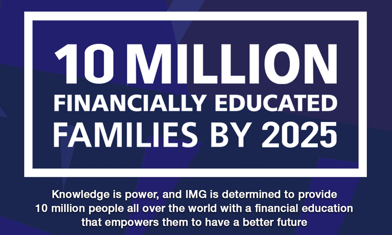
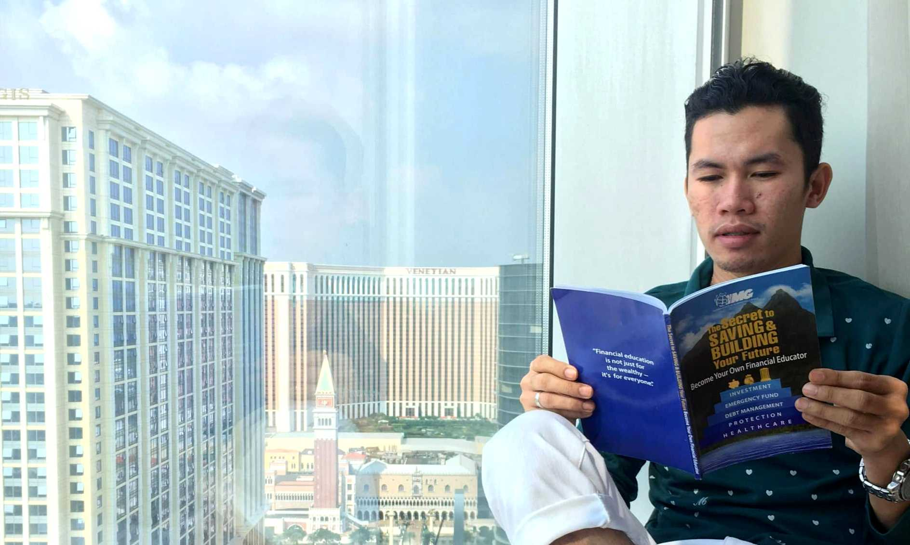

It has been 3 years while I was working as an ESL teacher in one of the biggest english schools in Cebu when I met IMG. I love what I do and in all those years, everything was okay. The salary was good, much better than my previous job. But, it was still not enough.

It made me wonder - ***why is my financial situation still the same?***  I work hard but every payday my money is always insufficient.  Where the heck did it all go?

Can you relate?

As a breadwinner of the family, I always provide even if I don't have enough money - that's actually my challenge!  Many of you are also working for your family and for some reason, you cannot say no to them because you know that you're the only person they can depend on.  I had no savings because I was supporting my sister's college education at that time. That's where my money went including my personal and other expenses.

 

Before I met IMG, my focus was on my work.  My life was just going to the office and home, it was so boring.  I am not a big spender but I still struggle that sometimes borrowing money was an option.  I just had to make ends meet. For 3 years, I never had savings, that’s how messed up my finances really was.

Until someone shared a book entitled, "***The Secret to Saving and Building Your Future***". He showed it to me and started explaining powerful financial concepts that I didn't even learn in school.  He introduced me the benefits which I believed, I didn't even have, not even one.  He then explained it to me, (you can see it here *https://www.imgchannel.com/privileges*)

After all those years, I've been looking for a break in life or an improvement in my finances. And because I was sick and tired of being sick and tired of having the same financial troubles, I gave myself a chance and listened to him and everything he said blew my mind.

He mentioned IMG and I remembered someone already shared it to me way back in 2016 but I didn't listen.  My ego at that time prevailed.  I thought it would be just like any other company out there. He invited me saying, "*Why not attend a financial seminar*". So, I agreed and also bought the book.

I read the book when I got home. The content was very realistic.  **I found out that my money problem was the lack of financial education**. If only I knew about this before I started working, I would have done better. So, I decided to visit the office and attended the seminar and what I heard made me realize how important it is to have enough knowledge about personal finance.

 

I said to myself that maybe this could be what I was looking for.  Yes, true enough, the universe heard me and brought me to this company that has the vision to transform individuals from spenders to savers.  With their **global financial campaign**, I am forever grateful to the person who opened it up to me.  Being part of the movement is already a life-changing opportunity.  Knowing that it changed me as a person and learning how to handle and discipline myself when it comes to saving money.  It really made an impact on my life. This is not just for me but for those who will be blessed with these financial concepts that give people a chance to improve themselves financially.

But knowledge is not enough if we don't use it and things won't change and improve.  Like what Bro. Bo Sanchez said, “***Financial education without execution is useless***”.  So, I applied what I learned and started saving and building a solid financial foundation for myself and my family.

The journey to financial freedom continues!