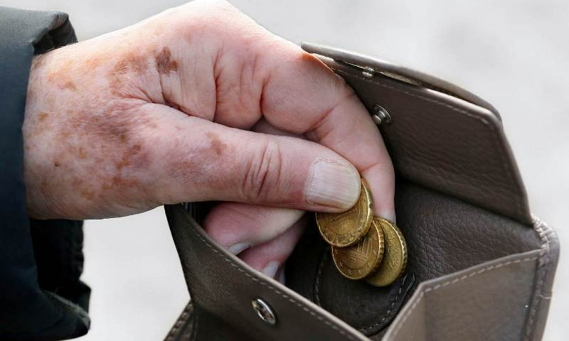
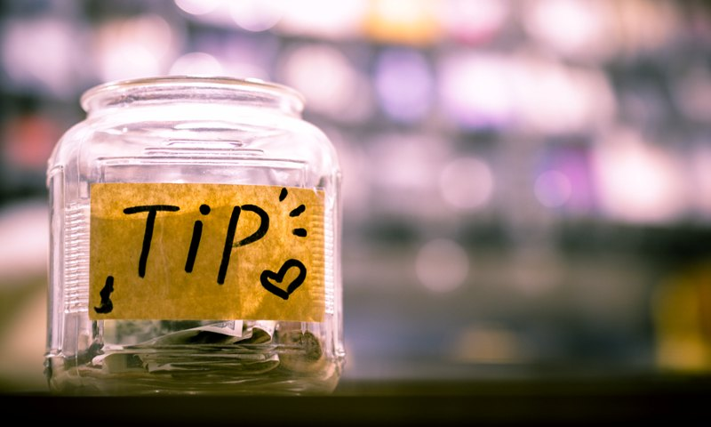
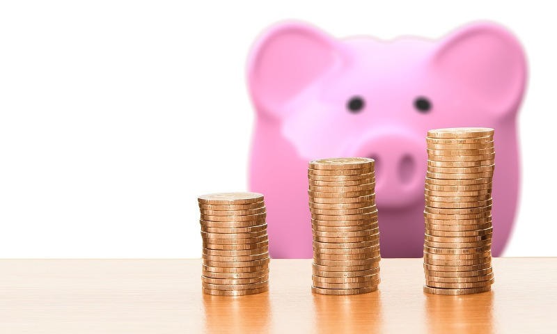

This was my mindset way back 20 years ago and it is this unseen force that affected my life in general, my financial life in particular.

*Gusto mo - maraming pera.
Deep inside you, you know you want this.*

You started to save. You feel you are up to something big.

But at the back of your mind, something whispers to you - *money is dirty, money is bad, you start to love money, money doesn't make you happy, it's against God's command, this and that...*

So as a result, you end up with a confused mind. Without further examination of consciousness, you hurriedly sabotage yourself.

***You end up spending all your saved up money.*** You end up spending more just to please the loved ones and friends - and you are willing to acquire debt just to show people that you care, you can afford, that you are doing good in your job, and that you are happy.

This is the life of most people I met.
This was me.

**Until I became part of IMG...**

It was 13 years ago - that I got a better perspective on money, that no School, Church, no Pastor nor Priest nor Parent can teach.

We love our parents, teachers, priests and pastors. But you have to go to the right community, right place, right people to teach you the appropriate things you need in life.

**Don't limit yourself.**

*If you want to grow in your spiritual life, you know where to go...*

*If you want to grow in your financial life, seek money mentors and financial educators.*

It was in this community that I learned the true purpose of money.

I basically realized this when I always see successful and rich business owners have wallets or pockets full of cash.

Contrary to what I learned growing up, these rich people that I've known carry cash with confidence. They are happy. They talk openly. They talk with conviction and straight to the point. They laugh and smile genuinely.

I further observed, that the ultimate purpose of their hand-carried cash was not to boost confidence or show off.

It's a chicken and egg thing - you might think they're confident because they have cash. In reality, it's mostly the other way around.

I found out that they are givers. Again, chicken and egg. You might think they give because they have wealth, it's mostly the other way around.

You might think, they're happy because they have money? No, mostly the reverse. They have wealth, and wealth stays and grows for them and their family, because they are genuinely happy within.

**Because they have a tiny portion of their wealth in their pockets/wallets/purse, they are able to do many wonderful things, including:**

* Giving a TIP to a waiter for great service
* Giving a TIP to the therapist after a good massage
* Giving a TIP to a car wash boy for a job well done
* Giving a TIP to the barber for a great cut
* Giving a GIFT to a street vendor or beggar
* Helping a FRIEND's immediate need for a Taxi fare change
* Buying a nice bouquet of flower for an occasion or a dear friend or loved ones' funeral (most flower shops along the road don't accept credit)
* Love Offering during a prayer or church gathering
* Grabbing a QUICK LUNCH or SNACK with a visitor friend
* Buying medicine for a loved one or friend or paying the doctor for an immediate visit or emergency
* Giving cash gift to a loved one, a son or daughter for a job well done at school
* Giving cash gift to a wedding/birthday/holiday, coz you haven't got enough time to shop for gifts
* many more

**Do you want to build wealth & change your life? Start GIVING.**

It's good to receive. When you receive, you must strive to become a good steward. You honor the giver when you take care of the gift and using it according to purpose.

***And the purpose of wealth is to give.***
So when you're given, you have to give.
When you give, you attract wealth.

Wealth must not stay with you, it must pass thru you, constantly according to its purpose. And it's purpose is for others to be genuinely enriched and be blessed. To build up lives and not destroy it. To be happy and fulfilled and rewarded.

**In this season, you can plant & give PEACE OF MIND:**

- don't waste too much money on material stuff, rather
- save money for your future
- save money for healthcare
- save money for retirement
- get senior health care for parents
- get long term care for family members
- invest in Mutulfunds (kids education)
- save for dream house/car/travel
- save for confidence and self-esteem
- start or get involved in an advocacy that helps people
- feed the under privileged (don't waste food)
- give for day to day, give for the future

***Saving money today for the right priorities in the future brings self-confidence.***

When you're self-confident, you can carry extra cash in your pocket after knowing you will have more than enough for the future.

This is no longer chicken and egg...
Start with saving money in the right programs...
Then Develop self-confidence...
You only have the right to carry cash in your wallet/pocket after when you start saving money

**You can give happily...**

(NOTE: *while your are in the process of changing your money perspective, you will be amazed at the opportunity that pops-up in front of you, which will enable you to increase cashflow, so you can save more and give more. That's how the universe works, water and air flows where there's a clear, unblocked passage/pathway. The same key with abundance too...*)

