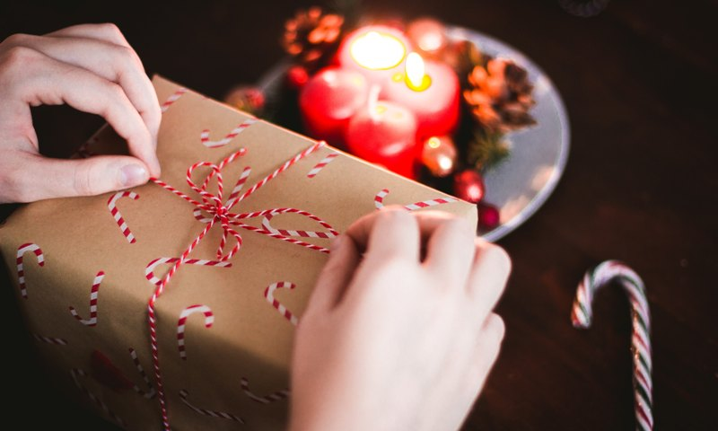

The Christmas season is very important for all people.  You don’t have to be a Christian to celebrate or appreciate it.  In this time of the year, almost everyone is in the “giving” spirit and that’s paramount.  Shopping malls are very busy because we buy gifts for our relatives, friends, and sometimes even strangers.  This is actually very good because we think of others more than ourselves at this time of year.  **When we are less selfish we become better people.**

I’m actually ok with people spending more during Christmas because they want to give.  Don’t feel guilty about spending to be part of the holiday spirit.  But just like anything else, overdoing something is terrible.

## Remember these tips to make the most of your Christmas giving experience:

* **Never go into debt buying gifts** - Use cash only for purchases because you tend to overspend using credit cards.
* **Gifts don’t have to be expensive** - Be resourceful and creative.
* **Don’t force it** - giving should be a joyful experience.  If you are financially struggling this year it’s ok if you can’t give like you want to.  There’s always next year.
* **Make it part of the budget** - Since Christmas is always in December, save ahead of time and plan for it.

Remember *“...God loves a cheerful giver.”* (2 Corinthians 9:7)
It’s very tough to be happy or cheerful if you’re in debt.

Strive to make your Christmas Season (Giving Season) better every year.
*Make all you can, Save all you can, and Give all you can.*

Merry Christmas everyone! :-)
