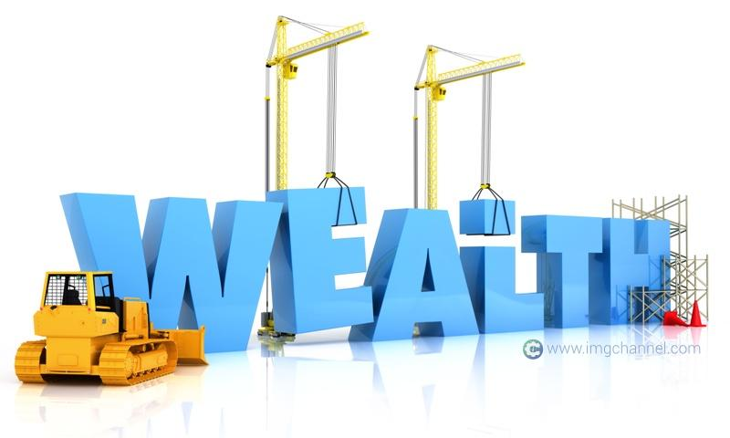
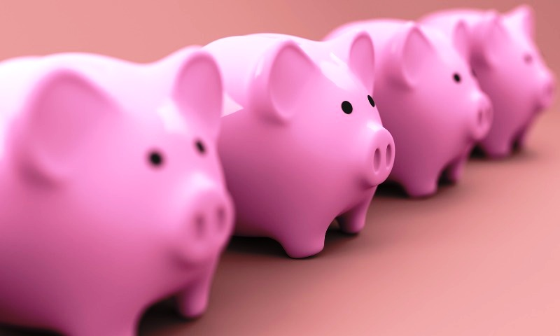

 1. **Read and Write** - this is the minimum requirement of DepED in the elementary education. This is a big help.

2. **Speak or Articulate** - if one can't read nor write, at least talk or understand the regular language / conversation.

3. **Survive** - if you can't read , write, speak the language, at least survive. Make friends, gather helpful info and make connections.

*These first 3 rules are the useful traits of early Chinese or Spanish migrants when they came to PH. Most of them, started with almost nothing but determination to survive, thrive and succeed.*

4. **Hardwork** - the first capital is energy (*effort*). The determined ones are those who use their energy only into productive, positive and profitable work.

5. **Be Frugal** - the money you make goes to only these: basic needs (*expense*) and back to business (*capital*). Almost all wealthy people owned and started a business.

6. **Be Patient** - the ability to wait and delay gratification is one universal trait of the successful and wealthy. Knowing what, how and when to reward oneself is a key.

7. **Be a Saver** - not just with money. This is synonymous to not being wasteful. Saving money is just another evidence to the attitude of not being wasteful. Traits like giving care to material stuff because it has value and it was bought by hard earned money, become the foundation of wealth.

8. **Be a Learner** - the sons and daughters of those determined survivors and starters all went to school. Knowledge and education is given a priority for the purpose of upgrade, growth and preservation of the financial wellbeing.

9. **Grow Money** - learn to set aside monetary savings for the purpose of investment (*growth*), old age, security and legacy. The real wealthy people respect and acknowledge the need for insurance (*to protect the business and self*), healthcare (*to leverage and preserve wealth*) and future financial stability of the next generation thru wealth inheritance.

10. **Travel** - wealthy people today, make the most of physical health thru travel. As long as they're healthy, they travel. Eversince, the ones that started the journey to wealth, all took risk to travel, explore and make allies and partners along the way. Therefore, still growing the business. I know business owners travel to source out supplies and new ideas for their own business.

11. **Give Back** - as soon as you start to make money, make a living, set aside something for giving. Always give along the way. Many people fail, because they promise to give when they have more. And more never comes. Either give monetary help, support a Church or Community or simply share to someone in need. It's a universal principle. That's why the wealthy are given rewards for being givers/philanthropist such as tax breaks.

12. **Care for Oneself and Loved Ones** - the real wealthy people have closed family bond. They have family support from the beginning. They spend money and give time to recreation, get together and big family events. This naturally strengthens the bond and minimize future conflicts. They recognised heirarchy within the family and respect of personality and ideas.

These *12 Rules* are more of traits or guiding principles of the wealthy based on my careful observation, interviews, reading of books, association and dialogues with some real life Wealthy Pinoy Families and friends gathered thru IMG's mission and way of connecting and building an organisation.

**May these rules add help & guidance to each one of us to stay the path towards Financial Freedom the IMG way.**